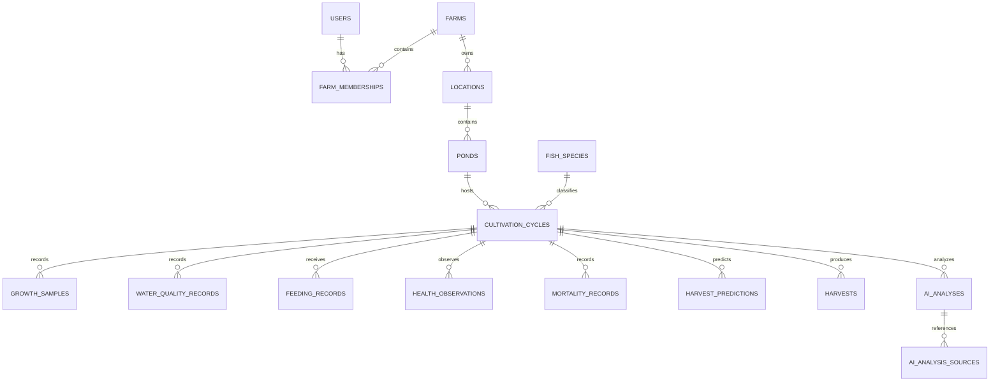

# Initial ERD

```mermaid
erDiagram
  USERS ||--o{ FARM_MEMBERSHIPS : has
  FARMS ||--o{ FARM_MEMBERSHIPS : contains
  FARMS ||--o{ LOCATIONS : owns
  LOCATIONS ||--o{ PONDS : contains
  PONDS ||--o{ CULTIVATION_CYCLES : hosts
  FISH_SPECIES ||--o{ CULTIVATION_CYCLES : classifies
  CULTIVATION_CYCLES ||--o{ GROWTH_SAMPLES : records
  CULTIVATION_CYCLES ||--o{ WATER_QUALITY_RECORDS : records
  CULTIVATION_CYCLES ||--o{ FEEDING_RECORDS : receives
  CULTIVATION_CYCLES ||--o{ HEALTH_OBSERVATIONS : observes
  CULTIVATION_CYCLES ||--o{ MORTALITY_RECORDS : records
  CULTIVATION_CYCLES ||--o{ HARVEST_PREDICTIONS : predicts
  CULTIVATION_CYCLES ||--o{ HARVESTS : produces
  CULTIVATION_CYCLES ||--o{ AI_ANALYSES : analyzes
  AI_ANALYSES ||--o{ AI_ANALYSIS_SOURCES : references
```
